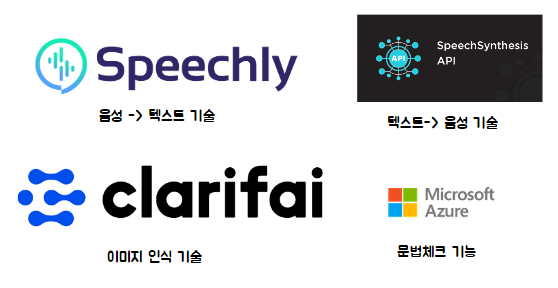
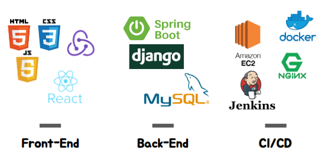
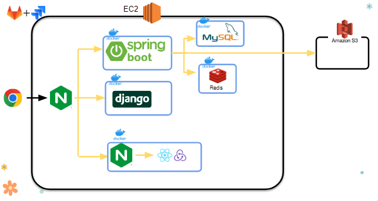
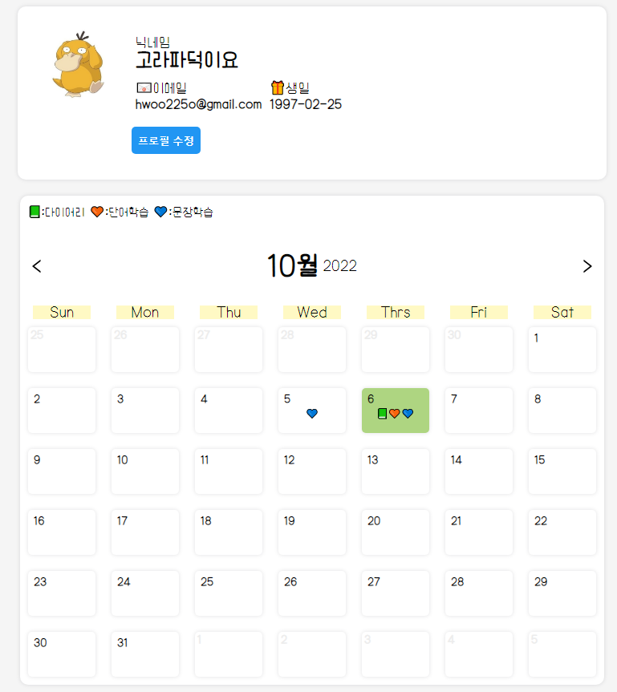
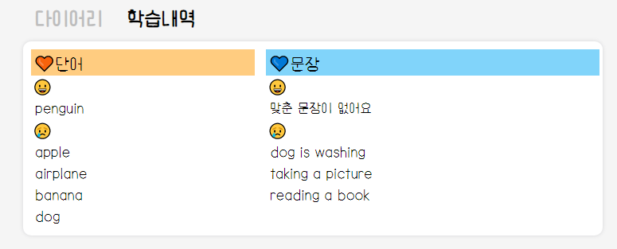
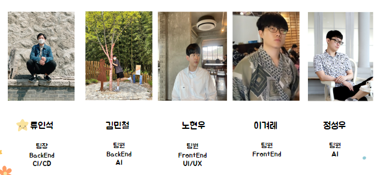

### :book: IEng( 초등학생을 위한 영어사진일기 서비스) 


## 1️⃣ 프로젝트 개요


### :green_heart: 기술 스택






### :heart: 프로젝트 아키텍처



### :green_heart: ERD


### :yellow_heart: Git branch naming

- Type
  - Feat - 새로운 기능 추가
  - Fix - 버그 수정
  - Build - 빌드 관련 파일 수정
  - Ci - CI관련 설정 수정
  - Docs - 문서 (문서 추가, 수정, 삭제)
  - Style - 스타일 (코드 형식, 세미콜론 추가: 비즈니스 로직에 변경 없는 경우)
  - Refactor - 코드 리팩토링
  - Test - 테스트 (테스트 코드 추가, 수정, 삭제: 비즈니스 로직에 변경 없는 경우)
  - Chore - 기타 변경사항 (빌드 스크립트 수정 등)

ex)

```shell
git commit -m “[#이슈번호] Feat: login”

git commit -m “[#이슈번호] Feat: logout”
```


## 2️⃣ 프로젝트 소개

### :purple_heart: 기획의도

- 기존의 읽기와 쓰기 위주의 학습은 장기적 어휘 기억에 불리
- 지루하게 느껴지는 딱딱한 공부로 교육의지 저하

### :heart: 주요 기능

- :speaking_head: STT, TTS를 사용한 문장, 단어 학습

  

  

- **:orange_book: 영어 일기**

  - **:robot: AI 이미지 인식**

  

  

  - **:robot: 문법 체크 기능**

  

  

- **:handshake: 프로필 기능**

  - 캘린더 기능으로 다이어리, 단어, 문장 확인 가능

    

    

  

### :yellow_heart: 장점

- 말하기 듣기 읽기 쓰기 모든 자극 방법으로 컨텐츠를 구성하여 학습 효율성을 높임
- 퀴즈와 이미지 업로드, AI 기술을 통해서 사용자 흥미 유발


### :blue_heart: 향후 계획

- 학습진행도에 따른 난이도 설정개발분야 외 다른 분야 강의 스터디 도입
- 학습 컨텐츠 추가
- 포인트샵 운영
- 데이터셋 추가하여 인식률 및 반응속도 개선.


### :family: 팀원

